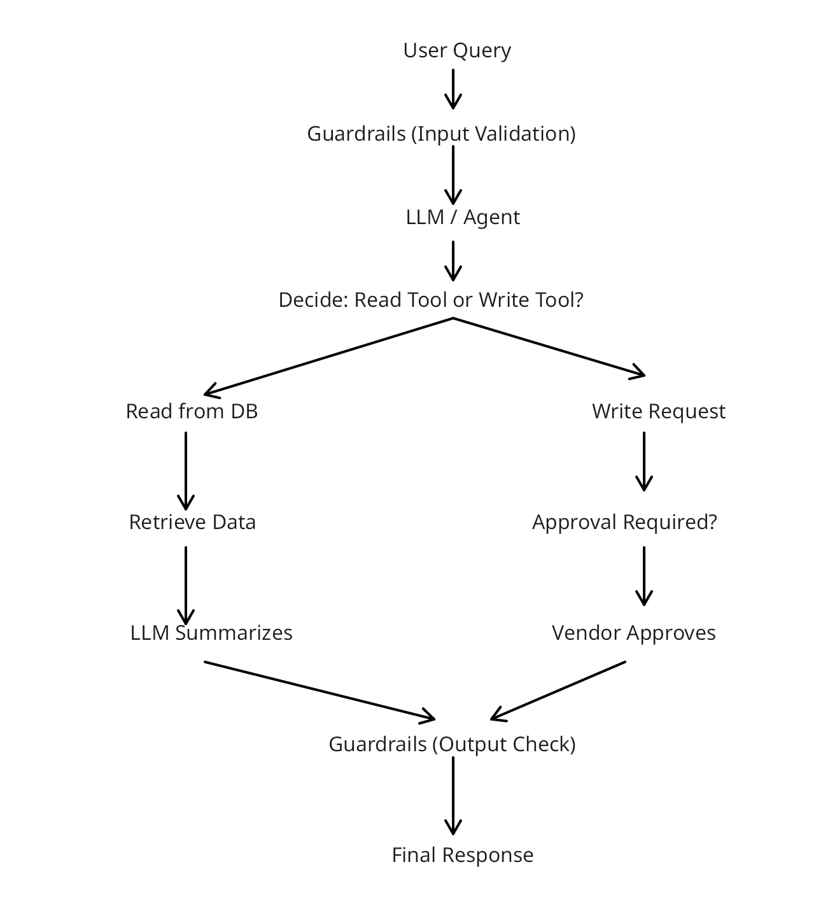

# 🤖 HobbyFi AI Copilot

An AI-powered business copilot built using **FastAPI**, **LangChain**, **Mistral AI**, and **SQLite** that allows business owners to interact with their business database using natural language.

Instead of writing SQL queries manually, users can simply ask questions like:

- "Show today's revenue."
- "List badminton users."
- "Increase Rahul's trial by 7 days."
- "Show his updated membership."

The system intelligently understands context, generates SQL, executes safe queries, and responds in natural language.

---

## ✨ Features

- ✅ Natural Language → SQL Generation
- ✅ Read & Write Query Routing
- ✅ AI Guardrails against Prompt Injection
- ✅ Short-Term Conversation Memory
- ✅ Natural Language Response Generation
- ✅ SQLite Database Integration
- ✅ Human Approval Workflow for Write Operations
- ✅ FastAPI Backend
- ✅ Streamlit Chat Interface

---

# 🏗️ System Architecture



### Flow

```
User Query
      │
      ▼
Guardrails (Security Validation)
      │
      ▼
LLM Router
      │
      ▼
Read Tool  ─────────────► SQL Generator ─────────► SQLite Database
      │                                           │
      │                                           ▼
      │                                 Natural Language Generator
      │                                           │
      └───────────────────────────────────────────┘


Write Tool
      │
      ▼
Generate SQL
      │
      ▼
Owner Approval
      │
      ▼
Database Update
```

---

# 🚀 Tech Stack

| Technology | Usage |
|------------|-------|
| Python | Backend |
| FastAPI | REST API |
| Streamlit | Chat UI |
| LangChain | LLM Orchestration |
| Mistral AI | SQL Generation & Reasoning |
| SQLite | Database |
| SQL | Data Retrieval & Updates |

---

# 📂 Project Structure

```
AI-COPILOT-HOBBYFI
│
├── app/
│   ├── agent.py
│   ├── guardrail.py
│   ├── sql_generator.py
│   ├── natural.py
│   ├── tools.py
│   ├── memory.py
│   ├── db.py
│   ├── config.py
│   ├── main.py
│   └── test_agent.py
│
├── database/
│   └── hobbyfi.db
│
├── FLOW.png
├── app.py
├── requirements.txt
└── README.md
```

---

# 🧠 AI Pipeline

### 1. Guardrails

Every user request first passes through an AI guardrail.

It blocks:

- Prompt Injection
- Ignore Previous Instructions attacks
- Database deletion attempts
- Malicious requests
- Unsafe commands

---

### 2. Query Router

The LLM classifies the request into:

- READ
- WRITE
- UNKNOWN

This determines which tool should execute the request.

---

### 3. SQL Generator

The SQL Generator converts natural language into optimized SQLite queries.

Example:

Input

```
Show today's revenue
```

Generated SQL

```sql
SELECT SUM(amount) AS total_revenue
FROM revenue
WHERE date = date('now');
```

---

### 4. Database Layer

The generated SQL is executed against an SQLite database containing:

### Users

- Name
- Email
- Sport
- Membership
- Trial End Date

### Revenue

- Customer Name
- Amount
- Date

---

### 5. Natural Language Generator

Instead of returning raw SQL results, the AI converts them into readable business insights.

Example

Instead of

```
2550
```

The assistant replies

```
Today's revenue is ₹2,550.
```

---

### 6. Conversation Memory

The system maintains short-term conversation history, enabling follow-up questions such as:

```
Show Rahul's details.
```

followed by

```
Increase his trial by 7 days.
```

The assistant correctly understands that **"his"** refers to Rahul.

---

### 7. Write Approval

Write operations are separated from read operations.

Before modifying the database:

- SQL is generated
- Owner approval is requested
- Database is updated only after approval

This prevents accidental data modification.

---

# 🔒 Security

The project includes an LLM-powered guardrail that blocks:

- Prompt Injection
- Jailbreak Attempts
- Ignore Previous Instructions
- Unauthorized Database Operations
- Malicious Requests

---

# 💬 Example Queries

### Revenue

```
Show today's revenue
```

```
Revenue for last 3 days
```

```
Revenue from July 5 till today
```

```
Show revenue table
```

---

### Users

```
List badminton users
```

```
Show Rahul details
```

```
Show his membership
```

---

### Write Operations

```
Increase Rahul's trial by 7 days
```

```
Change Rohit's membership to Silver
```

```
Extend his membership by one month
```

---

# 🎯 Current Capabilities

- Natural Language SQL Generation
- AI Query Routing
- Secure Guardrails
- SQLite Integration
- Conversation Memory
- Streamlit Interface
- FastAPI Backend
- Read & Write Operations
- Natural Language Responses

---

# 📈 Future Improvements

- PostgreSQL Support
- Authentication & Role-Based Access
- Persistent Conversation Memory
- Vector Database Integration
- Multi-Agent Workflow
- Audit Logs
- Dashboard & Analytics
- Real-time Notifications
- Docker Deployment
- Cloud Deployment (AWS/GCP/Azure)

---

# 🛠️ Installation

Clone the repository

```bash
git clone https://github.com/devanshh019/AI-COPILOT-HOBBYFI.git
```

Move into the project

```bash
cd AI-COPILOT-HOBBYFI
```

Install dependencies

```bash
pip install -r requirements.txt
```

Run the FastAPI backend

```bash
uvicorn app.main:app --reload
```

Run the Streamlit interface

```bash
streamlit run app.py
```

---

# 👨‍💻 Author

**Devansh Kumar Verma**

B.Tech Computer Science (AI & ML)

Passionate about AI Agents, Generative AI, LLM Applications, and Intelligent Automation.

GitHub: https://github.com/devanshh019

LinkedIn: https://www.linkedin.com/in/devansh-verma-ai

---

## ⭐ If you found this project interesting, consider giving it a star!